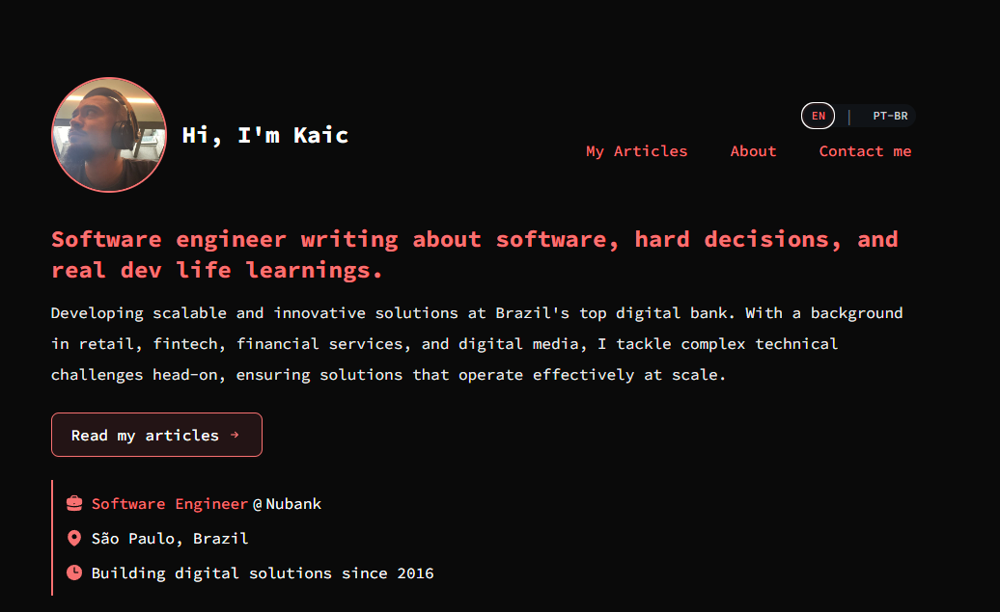

# kaic.me



This is my personal website built with Next.js, React, and Tailwind CSS, hosted at [kaic.me](https://kaic.me).

## Project Structure

The source code is on the `main` branch, and the production build is automatically deployed to the `production` branch via GitHub Actions.

### Key Directories and Files

- `.github/workflows`: Contains GitHub Actions deployment configuration
- `locales`: Internationalization files (en.json, pt-br.json)
- `pages`: Next.js Pages Router structure
- `public`: Static assets
- `src/app`: Main application components organized by section
  - `About`, `Articles`, `Contact`, etc: Section-specific components
  - `Components`: Reusable UI components
- `docs`: Documentation and project assets 
  - `tech-debts.md`: List of identified technical debts and future improvements
- Configuration files: next.config.js, eslint.config.mjs, .prettierrc.json

## Development

### Prerequisites

- Node.js 18+
- npm

### Getting Started

1. Clone the repository:

   ```bash
   git clone https://github.com/kaic/kaic.github.io.git
   cd kaic.github.io
   ```

2. Install dependencies:

   ```bash
   npm install
   ```

3. Run the development server:

   ```bash
   npm run dev
   ```

4. Open [http://localhost:3000](http://localhost:3000) in your browser to see the result.

## Building

To create a production build locally:

```bash
npm run build
```

This will generate static files in the `out` directory.

## Deployment

Deployment happens automatically when changes are pushed to the `main` branch. The GitHub Action workflow:

1. Builds the Next.js application
2. Creates a CNAME file with domain kaic.me
3. Deploys the built files to the `production` branch
4. GitHub Pages serves the content from the `production` branch

## Features

- 🌐 Multi-language support (English and Portuguese)
- 📱 Fully responsive design for all device sizes
- 📄 Article showcase with platform-specific links (Substack, Dev.to)
- 📊 Clean, minimalist UI focused on content
- 🔄 Automatic deployment via GitHub Actions

## Technologies Used

- [React](https://reactjs.org/) - JS Library
- [Next.js](https://nextjs.org/) - React framework
- [Tailwind CSS](https://tailwindcss.com/) - CSS framework
- [next-intl](https://next-intl-docs.vercel.app/) - Internationalization
- GitHub Actions - CI/CD
- GitHub Pages - Hosting

## Updating Content

### Adding New Articles

To add a new article, edit the `articlesList` array in `src/app/Articles/Articles.tsx`:

```typescript
{
  title: "Your Article Title",
  date: "YYYY-MM-DD",
  description: "Brief description of your article",
  sources: [
    {
      url: "https://example.com/article",
      language: "en", // or "pt-br"
      platform: "substack" // or "dev.to" or other platform
    }
  ]
}
```

## License

This project is open source and available under the [MIT License](LICENSE).
